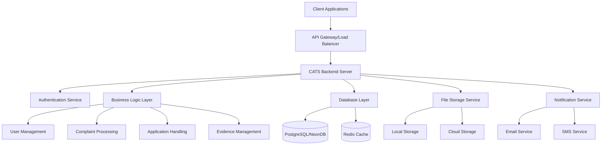
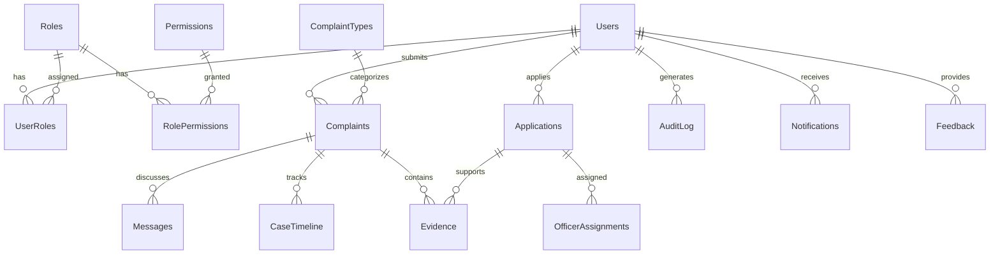

# 🚔 CATS Backend - Features Overview

<div align="center">


**Complaint and Application Tracking System**  
_Enterprise-grade Backend for District Cyber Crime Branch_

[](https://nodejs.org/)
[](https://expressjs.com/)
[](https://postgresql.org/)
[](https://neon.tech/)
[](https://jwt.io/)

</div>

---

## 📋 Table of Contents

- [🎯 Project Overview](#-project-overview)
- [✨ Core Features](#-core-features)
- [🏗️ System Architecture](#️-system-architecture)
- [🛡️ Security Features](#️-security-features)
- [📊 Database Design](#-database-design)
- [🌐 API Architecture](#-api-architecture)
- [⚡ Advanced Capabilities](#-advanced-capabilities)
- [🚀 Technology Stack](#-technology-stack)
- [📈 System Benefits](#-system-benefits)
- [📊 Project Statistics](#-project-statistics)
- [🔮 Future Roadmap](#-future-roadmap)

---

## 🎯 Project Overview

<div align="center">

### **CATS** - Complaint and Application Tracking System

_A comprehensive, secure, and scalable backend system for managing complaints and applications in a district-level Cyber Crime Branch._

</div>

| **Category**     | **Details**                                      |
| ---------------- | ------------------------------------------------ |
| **Purpose**      | District-level Cyber Crime Branch Management     |
| **Type**         | Enterprise-grade RESTful API Backend             |
| **Architecture** | Microservices-ready with modular design          |
| **Target Users** | Government agencies, Law enforcement, Citizens   |
| **Deployment**   | Production-ready with cloud database integration |

---

## ✨ Core Features

### 🔐 **User Management System**

<details>
<summary>Click to expand user management features</summary>

- **Multi-role Hierarchy**

  - 🏆 Super Admin (System oversight)
  - 👨‍💼 Admin (Department management)
  - 👮 Officer (Case handling)
  - 👤 Citizen (Complaint submission)

- **Authentication & Authorization**

  - JWT-based stateless authentication
  - Role-Based Access Control (RBAC)
  - Fine-grained permissions system
  - Employee ID integration for officers

- **Profile Management**
  - Email and phone verification
  - Profile photo upload
  - Department and designation tracking
  - Login history and security logs

</details>

### 📞 **Complaint Management**

<details>
<summary>Click to expand complaint management features</summary>

- **Complete Lifecycle Management**

  ```
  Draft → Submitted → Under Review → Investigation → Resolution → Closed
  ```

- **Complaint Types**

  - 💳 Cyber Fraud & Scams
  - 🆔 Identity Theft & Impersonation
  - 😡 Online Harassment & Cyberbullying
  - 🔒 Data Breach & Privacy Violations
  - 🎣 Phishing & Fake Websites
  - 🦠 Malware & Ransomware Attacks

- **Smart Features**
  - Auto-generated complaint numbers
  - Priority-based handling (Low, Medium, High, Critical)
  - Automatic officer assignment
  - SLA tracking and escalation
  - Geographic tagging and analysis

</details>

### 📄 **Application Processing**

<details>
<summary>Click to expand application processing features</summary>

- **Application Types**

  - 📋 NOC (No Objection Certificate)
  - ✅ Character Verification
  - 🔍 Cyber Security Audit
  - 🔬 Digital Forensics
  - 🎓 Training & Awareness Programs
  - 💼 Consultation Services

- **Processing Features**
  - Multi-step approval workflow
  - Document requirement tracking
  - Fee management and payment tracking
  - Certificate generation and validity
  - Renewal reminders and management

</details>

### 🕵️ **Evidence Management**

<details>
<summary>Click to expand evidence management features</summary>

- **Secure File Handling**

  - 🔒 Encrypted file storage
  - 🛡️ Virus scanning integration
  - 📁 Multiple format support (Images, Documents, Videos)
  - 🔗 Chain of custody tracking
  - ✅ File integrity verification

- **Advanced Features**
  - File compression and optimization
  - Metadata extraction and analysis
  - Access logging and audit trail
  - Secure sharing with authorized personnel
  - Evidence timeline correlation

</details>

---

## 🏗️ System Architecture



### **Architecture Principles**

- **🔄 Modular Design**: Separated concerns with clear boundaries
- **📈 Scalable Structure**: Horizontal scaling ready
- **🛡️ Security First**: Multiple security layers
- **🔧 Maintainable Code**: Clean architecture patterns
- **⚡ Performance Optimized**: Efficient data handling

---

## 🛡️ Security Features

<div align="center">

### **Multi-layered Security Architecture**

</div>

| **Layer**              | **Security Measures**      | **Implementation**                 |
| ---------------------- | -------------------------- | ---------------------------------- |
| **🔐 Authentication**  | JWT + Refresh Tokens       | Stateless, secure token management |
| **🎯 Authorization**   | RBAC System                | Fine-grained permission control    |
| **🔒 Data Protection** | AES-256-GCM Encryption     | Sensitive data encrypted at rest   |
| **🛡️ Input Security**  | Comprehensive Validation   | SQL injection & XSS prevention     |
| **⚡ Rate Limiting**   | Request Throttling         | DDoS and brute force protection    |
| **📋 Audit Logging**   | Complete Activity Tracking | Compliance and forensic analysis   |

### **Security Compliance**

- ✅ **GDPR** considerations
- ✅ **Government security** standards
- ✅ **Data privacy** regulations
- ✅ **Audit trail** requirements

---

## 📊 Database Design

<div align="center">

### **Comprehensive Data Model**

_18 interconnected models for complete system coverage_

</div>



### **📋 Database Models Overview**

| **Category**              | **Models**                                            | **Purpose**                                |
| ------------------------- | ----------------------------------------------------- | ------------------------------------------ |
| **👥 User Management**    | Users, Roles, Permissions, UserRoles, RolePermissions | Complete user hierarchy and access control |
| **📞 Complaint System**   | Complaints, ComplaintTypes, Evidence, Appeals         | End-to-end complaint processing            |
| **📄 Application System** | Applications, OfficerAssignments                      | Application lifecycle management           |
| **💬 Communication**      | Messages, Notifications                               | Internal and external communication        |
| **📊 Tracking & Audit**   | CaseTimeline, AuditLog, Feedback                      | Activity tracking and system monitoring    |
| **⚙️ Configuration**      | SystemSettings, SLARule                               | Dynamic system configuration               |

---

## 🌐 API Architecture

<div align="center">

### **RESTful API Design**

_50+ endpoints organized into 7 logical groups_

</div>

### **🔗 API Endpoint Groups**

```bash
🔐 Authentication APIs     /api/auth/*
├── POST /login           # User authentication
├── POST /register        # New user registration
├── POST /refresh         # Token refresh
├── POST /logout          # Secure logout
└── POST /forgot-password # Password recovery

👥 User Management APIs   /api/users/*
├── GET  /profile         # User profile
├── PUT  /profile         # Update profile
├── GET  /list           # User listing (admin)
└── POST /verify         # Email/phone verification

📞 Complaint APIs        /api/complaints/*
├── POST /submit         # Submit new complaint
├── GET  /list           # List complaints
├── GET  /:id            # Get complaint details
├── PUT  /:id/status     # Update status
└── GET  /:id/timeline   # Case timeline

📄 Application APIs      /api/applications/*
├── POST /submit         # Submit application
├── GET  /list           # List applications
├── GET  /:id            # Application details
└── PUT  /:id/approve    # Approve/reject

🕵️ Evidence APIs         /api/evidence/*
├── POST /upload         # Upload evidence
├── GET  /:id            # Download evidence
├── DELETE /:id          # Remove evidence
└── GET  /:id/verify     # Verify integrity

👨‍💼 Admin APIs            /api/admin/*
├── GET  /dashboard      # Admin dashboard
├── GET  /reports        # System reports
├── POST /settings       # System configuration
└── GET  /analytics      # Performance metrics

🌐 Public APIs           /api/public/*
├── GET  /status         # System status
├── GET  /complaint-types # Available types
└── GET  /info           # General information
```

### **📋 API Features**

- ✅ **Consistent Response Format**: Standardized JSON responses
- ✅ **Comprehensive Validation**: Input validation on all endpoints
- ✅ **Error Handling**: Detailed error messages and codes
- ✅ **Pagination**: Efficient data pagination
- ✅ **Filtering & Search**: Advanced query capabilities
- ✅ **Rate Limiting**: Request throttling per endpoint
- ✅ **Documentation**: Swagger/OpenAPI documentation

---

## ⚡ Advanced Capabilities

### 🔄 **Workflow Automation**

<details>
<summary>Automated business processes</summary>

- **Smart Assignment**

  - Automatic officer assignment based on expertise
  - Workload balancing algorithms
  - Geographic assignment preferences
  - Skill-based routing

- **SLA Management**

  - Automatic deadline calculation
  - Escalation triggers
  - Performance monitoring
  - Compliance reporting

- **Notification Engine**
  - Multi-channel notifications (Email, SMS)
  - Event-driven triggers
  - Template management
  - Delivery tracking

</details>

### 📊 **Analytics & Reporting**

<details>
<summary>Comprehensive insights and reporting</summary>

- **Real-time Dashboard**

  - Live complaint statistics
  - Officer performance metrics
  - System health monitoring
  - Resource utilization

- **Advanced Analytics**

  - Trend analysis and forecasting
  - Geographic crime mapping
  - Pattern recognition
  - Performance benchmarking

- **Report Generation**
  - Custom report builder
  - Scheduled report delivery
  - Multiple export formats (PDF, CSV, Excel)
  - Interactive visualizations

</details>

### ⚡ **Performance Optimization**

<details>
<summary>High-performance system design</summary>

- **Database Optimization**

  - Connection pooling (20-50 connections)
  - Query optimization with indexes
  - Database partitioning ready
  - Read replica support

- **Caching Strategy**

  - Redis integration ready
  - Query result caching
  - Session caching
  - File metadata caching

- **Background Processing**
  - Queue management system
  - Asynchronous task processing
  - Scheduled job execution
  - Email/SMS delivery queues

</details>

---

## 🚀 Technology Stack

<div align="center">

### **Modern, Scalable Technology Choices**

</div>

| **Category**          | **Technology**          | **Version** | **Purpose**                         |
| --------------------- | ----------------------- | ----------- | ----------------------------------- |
| **⚡ Runtime**        | Node.js                 | 18+         | High-performance JavaScript runtime |
| **🌐 Framework**      | Express.js              | 4.18+       | Fast, minimalist web framework      |
| **🗄️ Database**       | PostgreSQL              | 15+         | Robust relational database          |
| **☁️ Cloud DB**       | NeonDB                  | Latest      | Serverless PostgreSQL               |
| **🔍 ORM**            | Sequelize               | 6.35+       | Promise-based ORM                   |
| **🔐 Authentication** | JWT                     | 9.0+        | Stateless authentication            |
| **🔒 Encryption**     | bcrypt                  | 2.4+        | Password hashing                    |
| **📁 File Upload**    | Multer                  | 1.4+        | File handling middleware            |
| **✅ Validation**     | Joi + express-validator | Latest      | Input validation                    |
| **🛡️ Security**       | Helmet.js               | 7.1+        | Security headers                    |
| **📝 Logging**        | Winston                 | 3.11+       | Professional logging                |
| **📧 Email**          | Nodemailer              | 6.9+        | Email service                       |
| **📱 SMS**            | Twilio                  | 4.19+       | SMS service                         |
| **📊 Reports**        | PDF-lib + CSV-writer    | Latest      | Report generation                   |

### **🏗️ Architecture Benefits**

- **🚀 High Performance**: Optimized for concurrent requests
- **📈 Scalable**: Horizontal scaling ready
- **🔧 Maintainable**: Clean, modular codebase
- **🛡️ Secure**: Multiple security layers
- **☁️ Cloud Ready**: Containerized and cloud-optimized

---

## 📈 System Benefits

<div align="center">

### **Stakeholder Benefits**

</div>

### 👤 **For Citizens**

| **Benefit**          | **Description**                     |
| -------------------- | ----------------------------------- |
| **🚀 Easy Access**   | Simple complaint submission process |
| **👁️ Transparency**  | Real-time status tracking           |
| **🔒 Security**      | Secure document upload and storage  |
| **💬 Communication** | Direct communication with officers  |
| **📱 Mobile Ready**  | Responsive API for mobile apps      |

### 👮 **For Officers**

| **Benefit**                   | **Description**                       |
| ----------------------------- | ------------------------------------- |
| **📊 Centralized Management** | All cases in one system               |
| **⚡ Efficiency**             | Automated workflows and notifications |
| **🕵️ Evidence Tools**         | Advanced evidence management          |
| **📈 Performance Tracking**   | Individual and team metrics           |
| **🤝 Collaboration**          | Team communication tools              |

### 🏛️ **For Administration**

| **Benefit**                  | **Description**                 |
| ---------------------------- | ------------------------------- |
| **👁️ Complete Oversight**    | System-wide visibility          |
| **📊 Analytics**             | Performance and trend analysis  |
| **⚙️ Resource Optimization** | Data-driven resource allocation |
| **📋 Compliance**            | Audit trails and reporting      |
| **🔧 Configuration**         | Dynamic system settings         |

---

## 📊 Project Statistics

<div align="center">

### **Impressive Numbers**

</div>

```
📊 DATABASE MODELS        🌐 API ENDPOINTS         🛡️ SECURITY LAYERS
    18 Models                50+ Endpoints           7 Security Layers
    ├── Users (5)            ├── Auth (5)            ├── Authentication
    ├── Complaints (4)       ├── Users (4)           ├── Authorization
    ├── Applications (2)     ├── Complaints (8)      ├── Input Validation
    ├── Communication (2)    ├── Applications (6)    ├── Rate Limiting
    ├── Tracking (3)         ├── Evidence (5)        ├── Encryption
    └── Configuration (2)    ├── Admin (12)          ├── Audit Logging
                            └── Public (3)           └── Error Handling

⚡ PERFORMANCE METRICS    🔧 CODE ORGANIZATION    🚀 DEPLOYMENT READY
   Connection Pooling        Clean Architecture      Docker Support
   Query Optimization        Modular Design          Cloud Database
   Response Caching          Separation of Concerns  Environment Config
   Background Jobs           Error Boundaries        Health Checks
   Load Balancer Ready       Comprehensive Tests     Graceful Shutdown
```

### **📈 Quality Metrics**

- **🏗️ Architecture**: Enterprise-grade design patterns
- **🔒 Security**: Multi-layered security implementation
- **📊 Database**: Normalized schema with proper relationships
- **🌐 API**: RESTful design with comprehensive validation
- **📝 Documentation**: Complete API and setup documentation
- **🚀 Production**: Ready for immediate deployment

---

## 🔮 Future Roadmap

<div align="center">

### **Planned Enhancements & Features**

</div>

### **🎯 Phase 1: Core Enhancements**

- [ ] **📱 Mobile API Optimization**

  - Enhanced mobile-specific endpoints
  - Push notification support
  - Offline data synchronization
  - Mobile-optimized file uploads

- [ ] **🔄 Real-time Features**
  - WebSocket integration for live updates
  - Real-time chat and collaboration
  - Live dashboard updates
  - Instant notification delivery

### **🎯 Phase 2: Advanced Analytics**

- [ ] **🧠 Machine Learning Integration**

  - Predictive case analysis
  - Automatic case classification
  - Risk assessment algorithms
  - Pattern recognition for fraud detection

- [ ] **📊 Advanced Reporting**
  - Interactive dashboards
  - Custom report builder
  - Data visualization tools
  - Automated report scheduling

### **🎯 Phase 3: Integration & Expansion**

- [ ] **🔗 External Integrations**

  - Government database connections
  - Banking system integration
  - Social media monitoring
  - Third-party forensic tools

- [ ] **⛓️ Blockchain Implementation**
  - Evidence integrity verification
  - Immutable audit trails
  - Digital signatures
  - Chain of custody on blockchain

### **🎯 Phase 4: Advanced Features**

- [ ] **🤖 AI-Powered Features**

  - Chatbot for citizen queries
  - Automatic document processing
  - Intelligent case routing
  - Sentiment analysis for feedback

- [ ] **🌐 Multi-tenant Architecture**
  - Multiple department support
  - Cross-jurisdictional collaboration
  - Centralized vs. distributed modes
  - Inter-agency data sharing

---

<div align="center">

## 🚀 **Ready for Production Deployment**

[](https://github.com)
[](https://docker.com)
[](https://aws.amazon.com)

---

### **🎯 Enterprise-Grade Solution for Modern Law Enforcement**

_CATS Backend provides a robust, secure, and scalable foundation for managing cyber crime complaints and applications in government agencies._

**🔗 [Documentation](./README.md) | 🚀 [Quick Start](./scripts/README.md) | 🛡️ [Security Guide](./DEPLOYMENT_GUIDE.md)**

---

_Made with ❤️ for safer digital communities_

</div>
